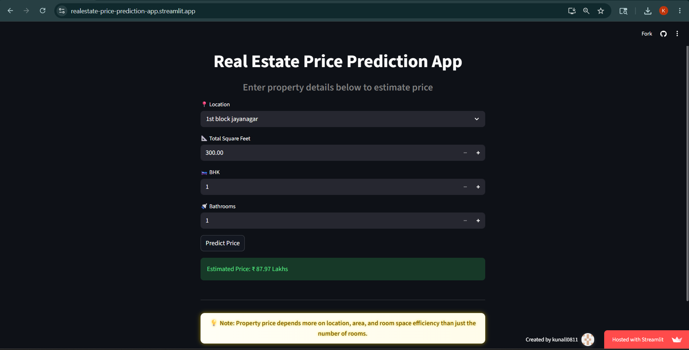

# 🏠 Real Estate Price Prediction Web App

## 🌐 Live Demo

👉 [Real Estate Price Prediction App](https://realestate-price-prediction-app.streamlit.app/?utm_source=chatgpt.com)

---

# 📌 Overview

This project is an end-to-end Machine Learning web application that predicts real estate property prices based on user inputs such as location, square footage, number of bedrooms (BHK), and bathrooms.

The application uses a trained regression model and is deployed using Streamlit, providing real-time predictions through an interactive and premium user interface.

---

# 🚀 Features

* 🔮 Instant property price prediction
* 📍 Location-based estimation
* 📐 Considers total square feet, BHK, and bathrooms
* 🧠 Feature engineering for improved prediction quality
* 🎨 Premium modern UI using Streamlit
* 🌐 Fully deployed live web application
* ⚡ Real-time prediction system

---

# 🧠 Machine Learning Workflow

## Model Used

* Linear Regression

## Feature Engineering

Implemented engineered features to improve realism and prediction accuracy:

* Average Room Size (`total_sqft / bhk`)

## Problems Solved

* Multicollinearity between features
* Location-based one-hot encoding

## Input Features

* Location
* Total Square Feet
* BHK
* Bathrooms

## Output

* Predicted House Price (in Lakhs)

---

# 🛠️ Tech Stack

* Python
* Pandas
* NumPy
* Scikit-learn
* Streamlit
* Pickle

---

# ⚙️ How to Run Locally

```bash
# Clone the repository
git clone https://github.com/Kunall0811/Real-Estate-Price-Prediction-App-Project.git

# Navigate into the project folder
cd Real-Estate-Price-Prediction-App-Project

# Create virtual environment
python -m venv venv

# Activate virtual environment
venv\Scripts\activate

# Install required packages
pip install -r requirements.txt

# Run the Streamlit app
streamlit run app.py
```

---

# 📸 Preview

Add your project screenshot here:



---

# 📊 Model Details

| Component           | Details                        |
| ------------------- | ------------------------------ |
| Algorithm           | Linear Regression              |
| Target Variable     | House Price                    |
| Input Features      | Location, sqft, BHK, bathrooms |
| Feature Engineering | Average Room Size              |
| Deployment          | Streamlit Cloud                |

---

# 🔥 Key Learnings

* End-to-end Machine Learning pipeline development
* Data cleaning and preprocessing
* Feature engineering for real estate data
* Handling multicollinearity in regression models
* Model serialization using Pickle
* Streamlit web app deployment
* Debugging real-world ML prediction issues
* Building premium UI for ML applications

---

# 🔮 Future Improvements

* Add price range prediction (min–max)
* Use advanced ML models like XGBoost or Random Forest
* Add analytics dashboard
* Add interactive charts and graphs
* Add map-based property selection
* Improve prediction accuracy using more real estate features

---

# 👨‍💻 Author

## Kunal Shelukar
